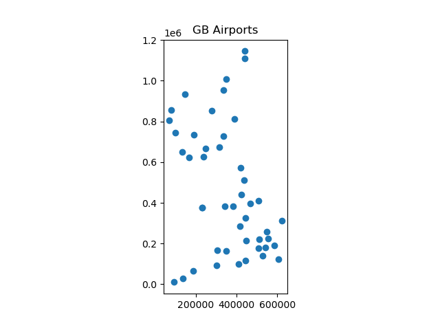

# Data Analysis in Python

## NumPy 

NumPy is the fundamental package for scientific computing in Python. It is a Python library that provides a 
multidimensional array object, various derived objects (such as masked arrays and matrices), and an assortment 
of routines for fast operations on arrays, including mathematical, logical, shape manipulation, sorting, 
selecting, I/O, discrete Fourier transforms, basic linear algebra, basic statistical operations, random 
simulation and much more.

At the core of the NumPy package, is the `ndarray` object. This encapsulates n-dimensional arrays of 
homogeneous data types, with many operations being performed in compiled code for performance. There are 
several important differences between NumPy arrays and the standard Python sequences:

+ NumPy arrays have a fixed size at creation, unlike Python lists (which can grow dynamically). Changing the 
  size of an `ndarray` will create a new array and delete the original.

+ The elements in a NumPy array are all required to be of the same data type, and thus will be the same size 
  in memory.

These restrictions together with the compiled code used in the NumPy functions makes NumPy much faster than 
normal Python arrays for many operations.

## Creating arrays from lists

`np.array([1,2,3,5,5])`

`np.array([range(i, i + 3) for i in [2, 4, 6]])` gives:

~~~python
array([[2, 3, 4], [4, 5, 6], [6, 7, 8]])
~~~

To create an array full of `0`s use `np.zeros(10, dtype=int)`, you can also use `np.arange(0,20,2)` to produce 
0 to 20 in steps of 2 and `np.linspace(0,1,5)` to give 5 values evenly spaced between 0 & 1.

NumPy Arrays have attributes:
+ `ndim` number of dimensions
+ `shape` the size of each dimension as a tuple.
+ `size` the size of the total array
+ `dtype` what is the type of the elements of the array (int, float32, etc)

You can slice arrays as you would lists or strings, including from the end using negative number or string.
Multiple dimension arrays are accessed as `x[1,2]` for the 3rd element of the 2nd row.

### Fast Functions on Arrays

Computations can use vectorization through the use of `ufuncs`. These are nearly always more efficient than 
their counterpart implemented through Python loops, especially as the arrays grow in size. Any time you see 
such a loop in a Python script, you should consider whether it can be replaced with a vectorized expression.

Simply apply the `ufunc` to the array, e.g:

~~~python
import numpy as np
np.random.seed(0)
def compute_reciprocals(values):
    output = np.empty(len(values))
    for i in range(len(values)):
        output[i] = 1.0 / values[i]
        return output

values = np.random.randint(1, 100, size=1000000)
compute_reciprocals(values)
# calculate reciprocal for all values
print(1.0/values)
~~~

The function takes 2+ seconds, `1.0/values` takes ~4ms

Also works for array to array operations including multidimensional arrays

You can also use the `reduce()` method to act across an array: `np.add.reduce(x)` gives the sum of the array 
elements, while `np.multiple.reduce(x)` gives the product of the array.

`np.sum` is a fast version of the python `sum` function, along with `np.min()` and `np.max()`. They all take 
an `axis` parameter to force action on rows or columns (etc).

## Pandas

Pandas is an open source Python package that is most widely used for data science/data analysis and machine 
learning tasks. It is built on top of another package named NumPy, which provides support for 
multi-dimensional arrays. As one of the most popular data wrangling packages, Pandas works well with many 
other data science modules inside the Python ecosystem, and is typically included in every Python 
distribution.

### A generalised NumPy array

~~~python
>>> import pandas as pd
>>> import numpy as np
>>> data = pd.Series([0.25, 0.5, 0.75, 1.0])
>>> data
0    0.25
1    0.50
2    0.75
3    1.00
dtype: float64
>>> data.index
RangeIndex(start=0, stop=4, step=1)
>>>
~~~

As this example the main difference between NumPy and Pandas is that the index of the `Series` is explicit in 
Pandas while it is implicit in NumPy. There is no need for it to be a simple range, any list will work.

~~~python
>>> data = pd.Series([0.25, 0.5, 0.75, 1.0], index=['a', 'b', 'c', 'd'])
>>> data
a    0.25
b    0.50
c    0.75
d    1.00
dtype: float64
>>> data['b']
0.50
>>> data.index
Index(['a', 'b', 'c', 'd'], dtype='object')
~~~

`Series` can be considered to be `dict`s and can be created from a `dict` with the keys of the `dict` being 
used as the index elements:

~~~py
>>> population_dict = {'California': 38332521, 'Texas': 26448193, 'New York': 19651127, 'Florida': 19552860, 'Illinois': 12882135}
>>> population = pd.Series(population_dict)
>>> population
California    38332521
Texas         26448193
New York      19651127
Florida       19552860
Illinois      12882135
dtype: int64
>>>
~~~

But slicing is supported even on essentially unordered indexes:

~~~py
>>> population['California':'New York']
California    38332521
Texas         26448193
New York      19651127
dtype: int64
>>>
~~~

A `DataFrame` is a generalised NumPy multidimensional array, that consists of one or more `Series`:

~~~py
>>> area_dict = {'California': 423967, 'Texas': 695662, 'New York': 141297, 'Florida': 170312, 'Illinois': 149995}
>>> area = pd.Series(area_dict)
>>> area
California    423967
Texas         695662
New York      141297
Florida       170312
Illinois      149995
dtype: int64
>>> states = pd.DataFrame({'population': population, 'area': area})
>>> states
            population    area
California    38332521  423967
Texas         26448193  695662
New York      19651127  141297
Florida       19552860  170312
Illinois      12882135  149995
>>>
~~~

So in addition to the `index` giving access to the rows, we also have `columns` - giving a generalised 2 
dimensional array. We can also treat the columns as a dictionary, allowing access by name, this is not 
possible by just index value, but does work with an index or filter expression:

~~~py
>>> states['area']
California    423967
Texas         695662
New York      141297
Florida       170312
Illinois      149995
Name: area, dtype: int64
>>> data['California']
Traceback (most recent call last):
  File "/usr/lib/python3/dist-packages/pandas/core/indexes/base.py", line 3361, in get_loc
    return self._engine.get_loc(casted_key)
  File "pandas/_libs/index.pyx", line 76, in pandas._libs.index.IndexEngine.get_loc
  File "pandas/_libs/index.pyx", line 108, in pandas._libs.index.IndexEngine.get_loc
  File "pandas/_libs/hashtable_class_helper.pxi", line 5198, in pandas._libs.hashtable.PyObjectHashTable.get_item
  File "pandas/_libs/hashtable_class_helper.pxi", line 5206, in pandas._libs.hashtable.PyObjectHashTable.get_item
KeyError: 'California'
~~~

You can construct a `DataFrame` from a `Series`, a `dict` of `Series`, a 2D NumPy array or a structured NumPy 
array.

#### Data access

You can use `DataFrame` as a dict `data[area]` or via attributes `data.area`, providing column name is a string and doesn't match a method of `DataFrame` (e.g. pop).

You can create new columns in the frame `data['density'] = data['pop']/data['area']`

### Reading a file with Pandas

~~~python
import pandas as pd

data = pd.read_csv('datafile.csv')
heights = np.array(data['height(cm)'])
~~~

## GeoPandas

GeoPandas, as the name suggests, extends the popular data science library pandas by adding support for 
geospatial data. The core data structure in GeoPandas is the `geopandas.GeoDataFrame`, a subclass of 
`pandas.DataFrame`, that can store geometry columns and perform spatial operations. The `geopandas.GeoSeries`, 
a subclass of `pandas.Series`, handles the geometries. Therefore, your `GeoDataFrame` is a combination of 
`pandas.Series`, with traditional data (numerical, boolean, text etc.), and `geopandas.GeoSeries`, with 
geometries (points, polygons etc.). You can have as many columns with geometries as you wish;

A `GeoDataFrame` can be constructed from a spatial data file, such as a geopackage or shapefile:

~~~py
>>> import geopandas as gp
>>> gdf = gp.read_file('/data/os-data/national-parks.shp')
>>> gdf
    CODE  ...                                           geometry
0   5820  ...  POLYGON ((317635.000 770725.000, 317078.000 77...
1   5820  ...  POLYGON ((308047.000 500000.000, 308050.000 50...
2   5820  ...  POLYGON ((259611.000 300000.000, 259763.000 30...
3   5820  ...  POLYGON ((209870.000 700000.000, 209940.000 70...
4   5820  ...  POLYGON ((400000.000 453080.000, 399940.000 45...
5   5820  ...  POLYGON ((550228.000 100000.000, 550138.000 10...
6   5820  ...  POLYGON ((500000.000 487140.000, 499650.000 48...
7   5820  ...  POLYGON ((400000.000 360330.000, 399930.000 36...
8   5820  ...  POLYGON ((300000.000 208070.000, 299817.000 20...
9   5820  ...  POLYGON ((400000.000 594660.000, 399230.000 59...
10  5820  ...  POLYGON ((249830.000 73470.000, 249590.000 736...
11  5820  ...  MULTIPOLYGON (((232234.000 600000.000, 232055....
12  5820  ...  POLYGON ((300000.000 132806.000, 299600.000 13...
13  5820  ...  POLYGON ((416177.000 99662.000, 416070.000 997...
14  5820  ...  POLYGON ((637924.000 300000.000, 637885.000 30...
15  5820  ...  MULTIPOLYGON (((200000.000 234385.000, 199944....
16  5820  ...  MULTIPOLYGON (((286860.000 760900.000, 287050....

[17 rows x 6 columns]

>>> gdf = gp.read_file('/data/os-data/OS_Open_Zoomstack.gpkg', layer='Airports')
>>> gdf.columns
Index(['name', 'geometry'], dtype='object')
>>> gdf['name']
0                                    Sumburgh Airport
1                                    Tingwall Airport
2                                    Kirkwall Airport
3         Port-Adhair Steòrnabhaigh/Stornoway Airport
4                          Wick John O'Groats Airport
5     Port-adhair Bheinn na Faoghla/Benbecula Airport
6                 Port-adhair Bharraigh/Barra Airport
7                                   Inverness Airport
8                      Aberdeen International Airport
9                                       Tiree Airport
~~~

All the expected geometric construction operations and intersection and difference methods are also available. 
The `matplotlib` module can also be used to produce maps of your data.

~~~py
>>> import matplotlib.pyplot as plt
>>> gdf.plot()
<AxesSubplot:>
>>> plt.title("GB Airports")
Text(0.5, 1.0, 'GB Airports')
>>> plt.show()
~~~

